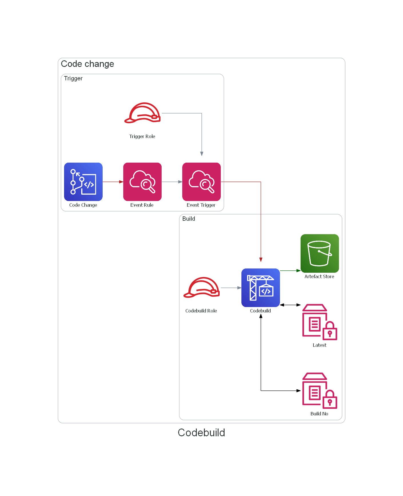

# terraform-aws-codebuild

[](https://github.com/JamesWoolfenden/terraform-aws-codebuild)
[](https://github.com/JamesWoolfenden/terraform-aws-codebuild/releases/latest)
[](https://github.com/JamesWoolfenden/terraform-aws-codebuild/releases/latest)

[](https://www.bridgecrew.cloud/link/badge?vcs=github&fullRepo=JamesWoolfenden%2Fterraform-aws-codebuild&benchmark=CIS+AWS+V1.2)
[](https://github.com/pre-commit/pre-commit)
[](https://www.checkov.io/)
[](https://www.bridgecrew.cloud/link/badge?vcs=github&fullRepo=JamesWoolfenden%2Fterraform-aws-codebuild&benchmark=INFRASTRUCTURE+SECURITY)

Terraform module to provision an AWS [`codebuild`](https://aws.amazon.com/codebuild/) CI/CD system.

When to use Codebuild:
If you want to stay with AWS, or when you are using ECR, Codepipeline or CodeCommit.

---



It's 100% Open Source and licensed under the [APACHE2](LICENSE).

## Usage

Include this repository as a module in your existing Terraform code:

```hcl
module "codebuild" {
  source                 = "jameswoolfenden/codebuild/aws"
  version                = "0.2.70"
  common_tags            = var.common_tags
  description            = var.description
  force_artifact_destroy = var.force_artifact_destroy
  name                   = var.name
  projectroot            = var.projectroot
  sourcecode             = var.sourcecode
}
```

As always a full example is included for reference.

## Testing

Every version of this module is built in Terraform using the the example **examplea** using Github Actions. It 100% has worked.
See the successes and failures here: <https://github.com/JamesWoolfenden/terraform-aws-codebuild/actions>

## Detailed Notes

These templates implement the module terraform-aws-codebuild. It includes a number of defaulted behaviours.

### Sample buildspec files

In the root directory there is an example `buildspec.yml`. This is a build specification you can supply to CodeCommit. It includes some basic codebuild functionality to drive semantic versioning using SSM parameters.

<!-- BEGINNING OF PRE-COMMIT-TERRAFORM DOCS HOOK -->
## Requirements

No requirements.

## Providers

| Name | Version |
|------|---------|
| <a name="provider_aws"></a> [aws](#provider\_aws) | n/a |

## Modules

No modules.

## Resources

| Name | Type |
|------|------|
| [aws_cloudwatch_event_rule.codechange](https://registry.terraform.io/providers/hashicorp/aws/latest/docs/resources/cloudwatch_event_rule) | resource |
| [aws_cloudwatch_event_target.triggerbuild](https://registry.terraform.io/providers/hashicorp/aws/latest/docs/resources/cloudwatch_event_target) | resource |
| [aws_codebuild_project.project](https://registry.terraform.io/providers/hashicorp/aws/latest/docs/resources/codebuild_project) | resource |
| [aws_iam_policy.trigger](https://registry.terraform.io/providers/hashicorp/aws/latest/docs/resources/iam_policy) | resource |
| [aws_iam_role.codebuild](https://registry.terraform.io/providers/hashicorp/aws/latest/docs/resources/iam_role) | resource |
| [aws_iam_role.trigger](https://registry.terraform.io/providers/hashicorp/aws/latest/docs/resources/iam_role) | resource |
| [aws_iam_role_policy.codebuild](https://registry.terraform.io/providers/hashicorp/aws/latest/docs/resources/iam_role_policy) | resource |
| [aws_iam_role_policy.codecommit](https://registry.terraform.io/providers/hashicorp/aws/latest/docs/resources/iam_role_policy) | resource |
| [aws_iam_role_policy_attachment.attachtotriggerrole](https://registry.terraform.io/providers/hashicorp/aws/latest/docs/resources/iam_role_policy_attachment) | resource |
| [aws_s3_bucket.artifacts](https://registry.terraform.io/providers/hashicorp/aws/latest/docs/resources/s3_bucket) | resource |
| [aws_s3_bucket_acl.example](https://registry.terraform.io/providers/hashicorp/aws/latest/docs/resources/s3_bucket_acl) | resource |
| [aws_s3_bucket_public_access_block.artifacts](https://registry.terraform.io/providers/hashicorp/aws/latest/docs/resources/s3_bucket_public_access_block) | resource |
| [aws_s3_bucket_server_side_encryption_configuration.example](https://registry.terraform.io/providers/hashicorp/aws/latest/docs/resources/s3_bucket_server_side_encryption_configuration) | resource |
| [aws_s3_bucket_versioning.example](https://registry.terraform.io/providers/hashicorp/aws/latest/docs/resources/s3_bucket_versioning) | resource |
| [aws_ssm_parameter.buildnumber](https://registry.terraform.io/providers/hashicorp/aws/latest/docs/resources/ssm_parameter) | resource |
| [aws_ssm_parameter.latest](https://registry.terraform.io/providers/hashicorp/aws/latest/docs/resources/ssm_parameter) | resource |
| [aws_caller_identity.current](https://registry.terraform.io/providers/hashicorp/aws/latest/docs/data-sources/caller_identity) | data source |
| [aws_iam_policy_document.codebuild](https://registry.terraform.io/providers/hashicorp/aws/latest/docs/data-sources/iam_policy_document) | data source |
| [aws_iam_role.existing](https://registry.terraform.io/providers/hashicorp/aws/latest/docs/data-sources/iam_role) | data source |
| [aws_region.current](https://registry.terraform.io/providers/hashicorp/aws/latest/docs/data-sources/region) | data source |

## Inputs

| Name | Description | Type | Default | Required |
|------|-------------|------|---------|:--------:|
| <a name="input_artifact"></a> [artifact](#input\_artifact) | Populates the Artifact block | `map` | <pre>{<br>  "namespace_type": "NONE",<br>  "packaging": "NONE"<br>}</pre> | no |
| <a name="input_artifact_type"></a> [artifact\_type](#input\_artifact\_type) | The Artifact type, S3, CODEPIPELINE or NO\_ARTIFACT | `string` | `"S3"` | no |
| <a name="input_bucketname"></a> [bucketname](#input\_bucketname) | n/a | `string` | `""` | no |
| <a name="input_build_timeout"></a> [build\_timeout](#input\_build\_timeout) | The time to wait for a CodeBuild to complete before timing out in minutes (default: 5) | `string` | `"60"` | no |
| <a name="input_common_tags"></a> [common\_tags](#input\_common\_tags) | An AWS tagging scheme | `map(any)` | n/a | yes |
| <a name="input_defaultbranch"></a> [defaultbranch](#input\_defaultbranch) | The default git branch | `string` | `"master"` | no |
| <a name="input_description"></a> [description](#input\_description) | Yeah it's the description | `string` | `""` | no |
| <a name="input_encryption_disabled"></a> [encryption\_disabled](#input\_encryption\_disabled) | Disable the encryption of artifacts | `bool` | `false` | no |
| <a name="input_environment"></a> [environment](#input\_environment) | A map to describe the build environment and populate the environment block | `map(any)` | <pre>{<br>  "compute_type": "BUILD_GENERAL1_SMALL",<br>  "image": "aws/codebuild/nodejs:6.3.1",<br>  "privileged_mode": "false",<br>  "type": "LINUX_CONTAINER"<br>}</pre> | no |
| <a name="input_force_artifact_destroy"></a> [force\_artifact\_destroy](#input\_force\_artifact\_destroy) | Force the removal of the artifact S3 bucket on destroy (default: false). | `string` | `false` | no |
| <a name="input_kms_key_id"></a> [kms\_key\_id](#input\_kms\_key\_id) | Your Custom KMS key | `string` | `""` | no |
| <a name="input_mfa_delete"></a> [mfa\_delete](#input\_mfa\_delete) | Require MFA to delete | `string` | `"Disabled"` | no |
| <a name="input_name"></a> [name](#input\_name) | The name of the Build | `string` | n/a | yes |
| <a name="input_projectroot"></a> [projectroot](#input\_projectroot) | The name of the parent project for SSM | `string` | `"core"` | no |
| <a name="input_reponame"></a> [reponame](#input\_reponame) | The name of the repository | `string` | `""` | no |
| <a name="input_role"></a> [role](#input\_role) | Override for providing a role | `string` | `""` | no |
| <a name="input_sourcecode"></a> [sourcecode](#input\_sourcecode) | A map to describe where your sourcecode comes from, to fill the sourcecode block in a Codebuild project | `map(any)` | <pre>{<br>  "buildspec": "",<br>  "location": "",<br>  "type": "CODECOMMIT"<br>}</pre> | no |
| <a name="input_sse_algorithm"></a> [sse\_algorithm](#input\_sse\_algorithm) | The type of encryption algorithm to use | `string` | `"aws:kms"` | no |
| <a name="input_versioning"></a> [versioning](#input\_versioning) | Set bucket to version | `string` | `"Enabled"` | no |

## Outputs

| Name | Description |
|------|-------------|
| <a name="output_artifact_bucket"></a> [artifact\_bucket](#output\_artifact\_bucket) | n/a |
| <a name="output_codebuild_role_name"></a> [codebuild\_role\_name](#output\_codebuild\_role\_name) | n/a |
| <a name="output_project"></a> [project](#output\_project) | n/a |
<!-- END OF PRE-COMMIT-TERRAFORM DOCS HOOK -->

## Policy Requirement

<!-- BEGINNING OF PRE-COMMIT-PIKE DOCS HOOK -->
The Policy required is:

```json
{
    "Version": "2012-10-17",
    "Statement": [
        {
            "Sid": "VisualEditor0",
            "Effect": "Allow",
            "Action": [
                "events:DeleteRule",
                "events:DescribeRule",
                "events:ListTagsForResource",
                "events:ListTargetsByRule",
                "events:PutRule",
                "events:PutTargets",
                "events:RemoveTargets"
            ],
            "Resource": "*"
        },
        {
            "Sid": "VisualEditor1",
            "Effect": "Allow",
            "Action": [
                "iam:AttachRolePolicy",
                "iam:CreatePolicy",
                "iam:CreateRole",
                "iam:DeletePolicy",
                "iam:DeleteRole",
                "iam:DeleteRolePolicy",
                "iam:DetachRolePolicy",
                "iam:GetPolicy",
                "iam:GetPolicyVersion",
                "iam:GetRole",
                "iam:GetRolePolicy",
                "iam:ListAttachedRolePolicies",
                "iam:ListInstanceProfilesForRole",
                "iam:ListPolicyVersions",
                "iam:ListRolePolicies",
                "iam:PutRolePolicy",
                "iam:TagRole"
            ],
            "Resource": "*"
        },
        {
            "Sid": "VisualEditor2",
            "Effect": "Allow",
            "Action": [
                "kms:CreateKey",
                "kms:Decrypt",
                "kms:DescribeKey",
                "kms:EnableKeyRotation",
                "kms:GetKeyPolicy",
                "kms:GetKeyRotationStatus",
                "kms:ListResourceTags",
                "kms:ScheduleKeyDeletion"
            ],
            "Resource": "*"
        },
        {
            "Sid": "VisualEditor3",
            "Effect": "Allow",
            "Action": [
                "s3:CreateBucket",
                "s3:DeleteBucket",
                "s3:GetAccelerateConfiguration",
                "s3:GetBucketAcl",
                "s3:GetBucketCORS",
                "s3:GetBucketLogging",
                "s3:GetBucketObjectLockConfiguration",
                "s3:GetBucketPolicy",
                "s3:GetBucketPublicAccessBlock",
                "s3:GetBucketRequestPayment",
                "s3:GetBucketTagging",
                "s3:GetBucketVersioning",
                "s3:GetBucketWebsite",
                "s3:GetEncryptionConfiguration",
                "s3:GetLifecycleConfiguration",
                "s3:GetObject",
                "s3:GetObjectAcl",
                "s3:GetReplicationConfiguration",
                "s3:ListAllMyBuckets",
                "s3:ListBucket",
                "s3:PutBucketAcl",
                "s3:PutBucketPublicAccessBlock",
                "s3:PutBucketVersioning",
                "s3:PutEncryptionConfiguration"
            ],
            "Resource": "*"
        },
        {
            "Sid": "VisualEditor4",
            "Effect": "Allow",
            "Action": [
                "ssm:AddTagsToResource",
                "ssm:DeleteParameter",
                "ssm:DescribeParameters",
                "ssm:GetParameter",
                "ssm:GetParameters",
                "ssm:ListTagsForResource",
                "ssm:PutParameter"
            ],
            "Resource": "*"
        }
    ]
}

```
<!-- END OF PRE-COMMIT-PIKE DOCS HOOK -->

## Related Projects

Check out these related projects.

- [terraform-aws-codecommit](https://github.com/jameswoolfenden/terraform-aws-codebuild) - Storing ones code

## Help

**Got a question?**

File a GitHub [issue](https://github.com/jameswoolfenden/terraform-aws-codebuild/issues).

## Contributing

### Bug Reports & Feature Requests

Please use the [issue tracker](https://github.com/jameswoolfenden/terraform-aws-codebuild/issues) to report any bugs or file feature requests.

## Copyrights

Copyright © 2019-2022 James Woolfenden

## License

[](https://opensource.org/licenses/Apache-2.0)

See [LICENSE](LICENSE) for full details.

Licensed to the Apache Software Foundation (ASF) under one
or more contributor license agreements. See the NOTICE file
distributed with this work for additional information
regarding copyright ownership. The ASF licenses this file
to you under the Apache License, Version 2.0 (the
"License"); you may not use this file except in compliance
with the License. You may obtain a copy of the License at

<https://www.apache.org/licenses/LICENSE-2.0>

Unless required by applicable law or agreed to in writing,
software distributed under the License is distributed on an
"AS IS" BASIS, WITHOUT WARRANTIES OR CONDITIONS OF ANY
KIND, either express or implied. See the License for the
specific language governing permissions and limitations
under the License.

### Contributors

[![James Woolfenden][jameswoolfenden_avatar]][jameswoolfenden_homepage]<br/>[James Woolfenden][jameswoolfenden_homepage]

[jameswoolfenden_homepage]: https://github.com/jameswoolfenden
[jameswoolfenden_avatar]: https://github.com/jameswoolfenden.png?size=150
